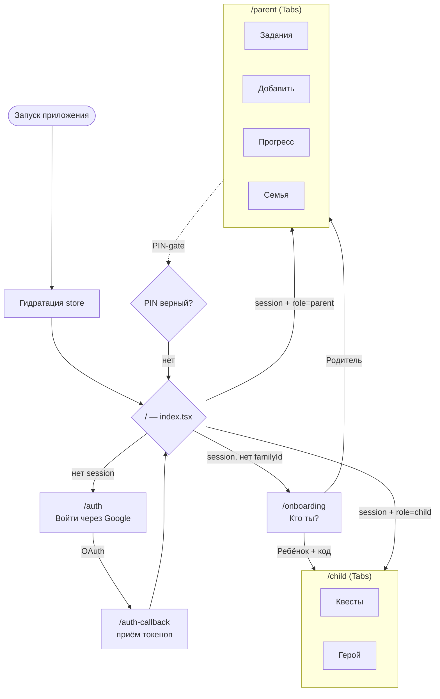
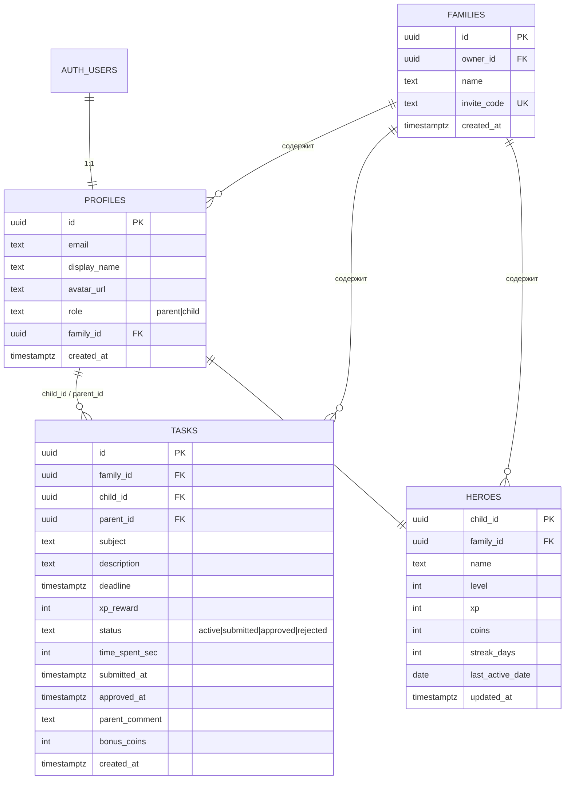
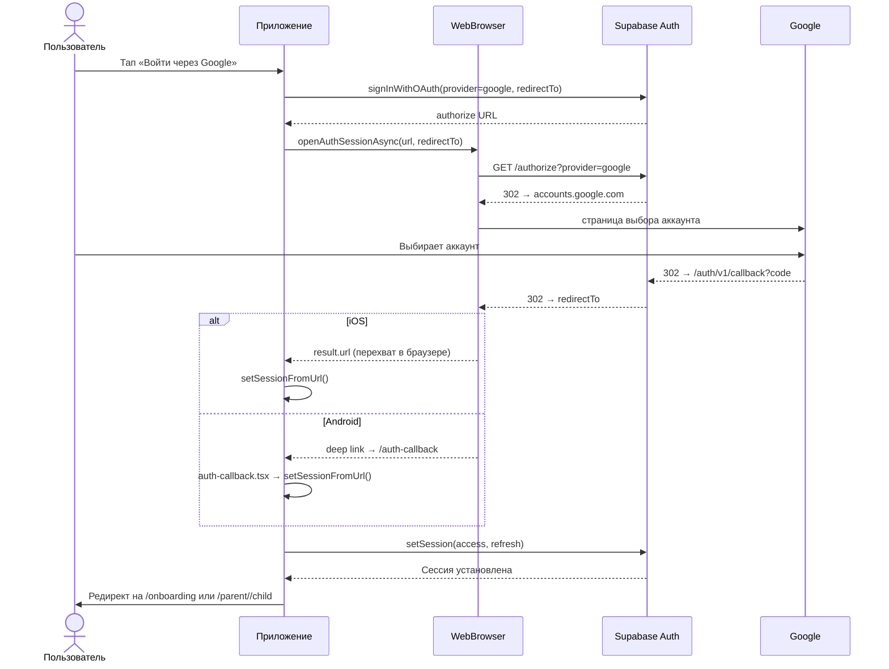
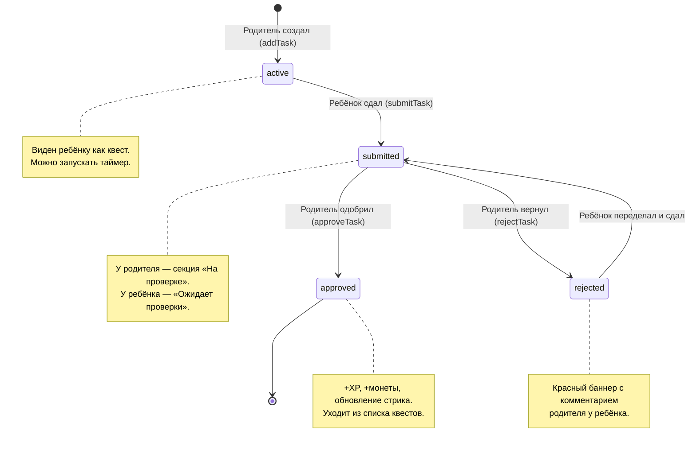
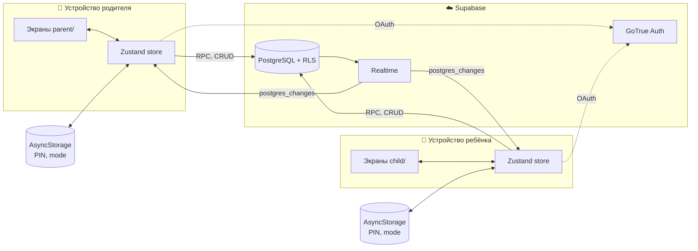
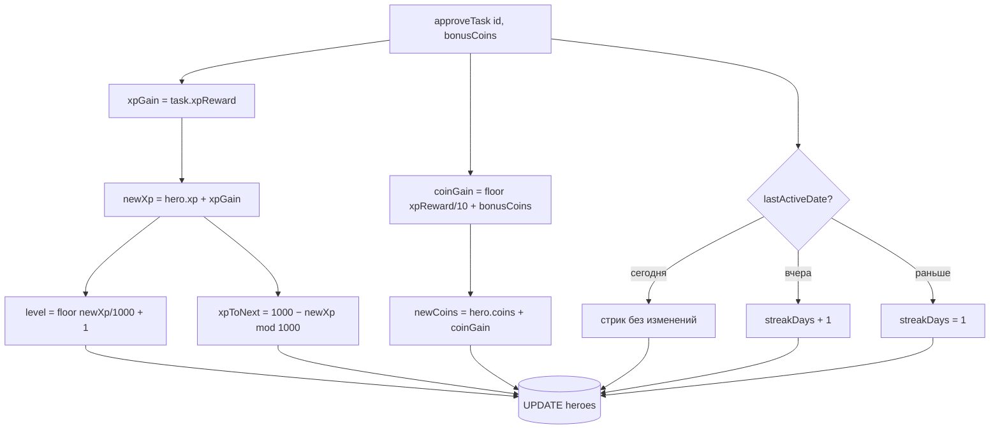

# Герой домашки — Диаграммы

Все диаграммы в формате [Mermaid](https://mermaid.js.org/) — рендерятся на
GitHub, в VS Code (с расширением) и на mermaid.live.

---

## 1. Навигация и роутинг (expo-router)

Как пользователь попадает на нужный экран в зависимости от auth-состояния.

---

## 2. Схема базы данных (ER)

---

## 3. Поток авторизации Google OAuth

---

## 4. Жизненный цикл задания

---

## 5. Архитектура и синхронизация

---

## 6. Геймификация — расчёт наград

